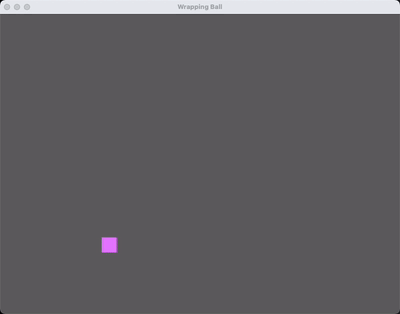

# Bevy Wrapping Square example

A simple example showcasing how to use Bevy to display a square with acceleration (controllable with your keyboard) that wraps around the screen!




## Usage

Clone locally and run:

```bash
git clone https://github.com/lmammino/bevy-wrapping-square.git
cd bevy-wrapping-square
cargo run
```

It requires a recent version of the Rust compiler.


## Controls

Keyboard only controls:

- `⬆️` accelerate up
- `⬇️` accelerate down
- `➡️` accelerate right
- `⬅️` accelerate left


## Contributing

Everyone is very welcome to contribute to this project.
You can contribute just by submitting bugs or suggesting improvements by
[opening an issue on GitHub](https://github.com/lmammino/bevy-wrapping-square/issues).


## License

Licensed under [MIT License](LICENSE). © Luciano Mammino.
